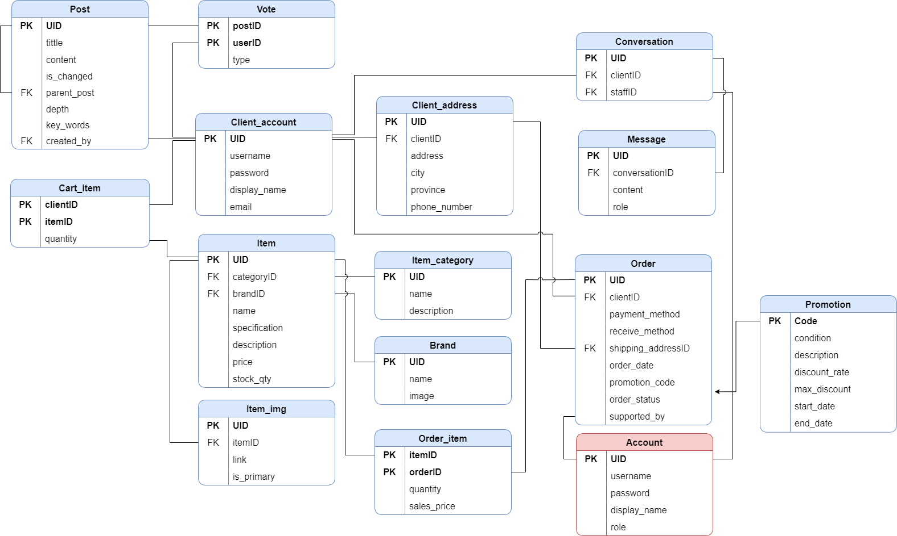

#        **Computer Store Management System**
### _Website Application development_

## 📄 **Project Overview**
This is my personal project, carried out with other team members in the same course. This project help me to gain knowledge and practical experience in web development project as a Business Analyst.

## 📋 **Introduction**
- ### Introduction
    In response to the evolving digital landscape, our team initiated a project to transform the online retail experience for computer hardware. Leveraging modern web technologies like RESTful API, ReactJS, C#, and NodeJS, we developed a dynamic e-commerce website. Through innovative features such as AI Chatbot and PC Builder, we enhanced customer interaction while facilitating seamless sales management for administrators. This endeavor not only met the demands of today's tech-savvy consumers but also elevated the standard of online retail in the computer hardware industry.

- ### Objectives of the project
    Our application was created in order to achieve faster searching for large databases, and improve online communication between our clients and company. Here are some of our app’s main features:
    - Sign in/ Sign up for users
    - Explore products
    - Build PC
    - Add to cart / checkout
    - Live chat with AI Bot/Staff
    - Manage Orders
    - Manage Products
    - Manage Customer Service
    - Manage Users
    - Manage Reports
    - Forums
- ### Scope of project | Limitations of the study
    Due to the lack of time, human and expenses, we couldn’t finish all of the features above the objective of our projects. Here are some of our main features that we spent the most time on:
    - Sign in/ Sign up for users
    - Explore products
    - Build PC
    - Add to cart / checkout
    - Live chat with AI Bot
    - Manage Orders
    - Manage Products
    - Manage Promotions
    - Manage Users
    - Manage Reports
- ### Development tools
    - IDE: Visual Studio Code
    - Frontend: ReactJS, Chakra-UI & TailwindCSS
    - Backend: NodeJS, Python for built RESTful API
    - Database: MySQL
    - Others: Figma, Git/Github, Docker,..
## 🔎 **Software Specification**
- ### Usecase diagram

- ### Database diagram

- ### System Architecture

## 🛠 Design

- [Figma design here !](https://www.figma.com/file/xhSreqWT5Q5YKeqPJDcRhC/Shieldtify?type=design&node-id=0%3A1&mode=design&t=PWa0pRkWEGeDRaML-1)

## 📜 Others
- [AI Chatbot - Demo explaination](https://youtu.be/rLT0yXt-gTU)
- [User Interface](https://youtu.be/rLT0yXt-gTU)

## 🤝 Contribution
    
| Member | Contributions |
| ------ | ------ |
| Le Quoc Khanh | BE developer, System architect and  Project manager|
| Le Gia Kiet | System Analyst and Design, UI/UX Design and Project sub-manager |
| Ninh Thien Bao | FE Developer and Reporter |
| Nguyen Thi Thuy | Main Reporter and Testing

## 📧 Contact [Here !](g.kietle@gmail.com)

Thanks for your attention ! <3